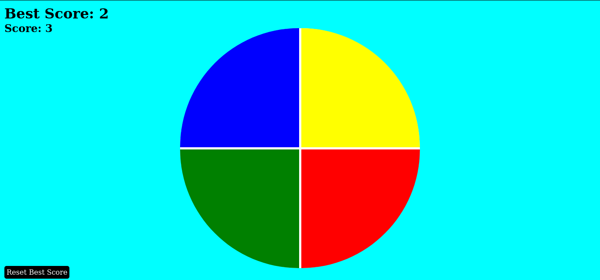

# Genius-Memory-Game-JS  
Jogo de memorizar uma sequência de cores que vai aumentando a cada fase.  

## Motivação  
  - Praticar meus conhecimentos em javascript, funções, EventListener, manipulação do DOM, localStorage.  
  - Criado com base em um desafio na plataforma da DIO (Digital Innovation One).

## Como funciona?  
  - O jogo escolhe uma cor aleatória e o jogador deve clicar na cor que foi selecionada, na próxima fase o jogo irá mostrar novamente a sequência de cores adicionando mais uma cor ao final.  
  - Toda cor selecionada toca um som para ajudar na memorização.  
  - NO canto superior esquedo mostra os pontos (score) e o maior recorde de pontos atigindos (best score).  
  - O Best Score fica salvo no localStorage e atualiza ao fim do jogo, quando o jogador perde o bestScore é atualizado.
    
